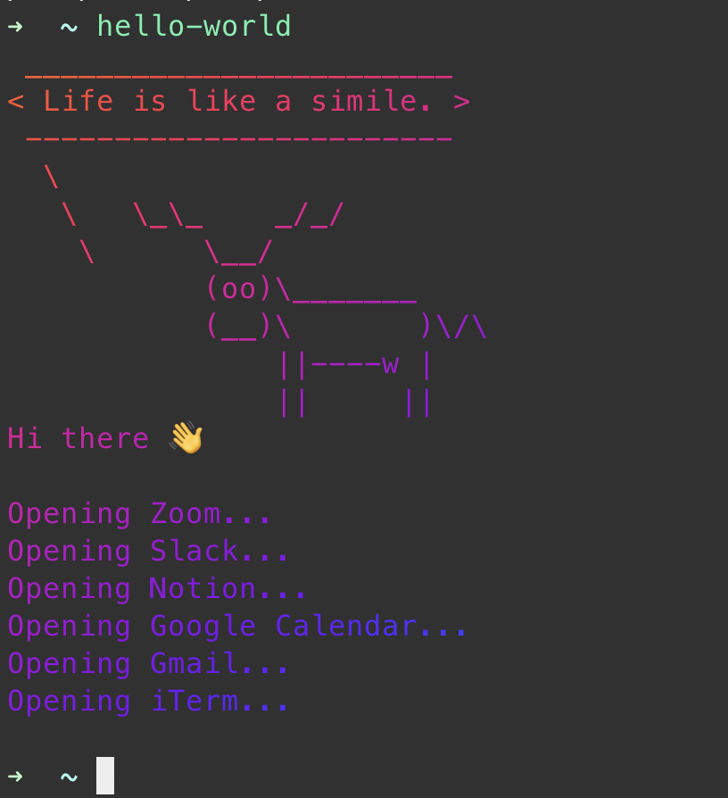

<h1>hello-world</h1>
hello-world is a simple script for macOS. It opens common apps that are used everyday for work such as Notion, Slack, Zoom etc.

You can run this script first thing in the morning to set up your system for the day.

Along with starting your apps, it also shows a random fortune cookie message.

<h3>Prerequisites</h3>

1. Install lolcat: `brew install lolcat`
2. Install fortune: `brew install fortune`
3. Install cowsay: `brew install cowsay`

<h3>Usage</h3>
Add an alias for the script in .zshrc:

`alias hello-world='python <replace-with-project-directory-path>/hello-world.py | lolcat'`

Run the script from your terminal:
`hello-world`

